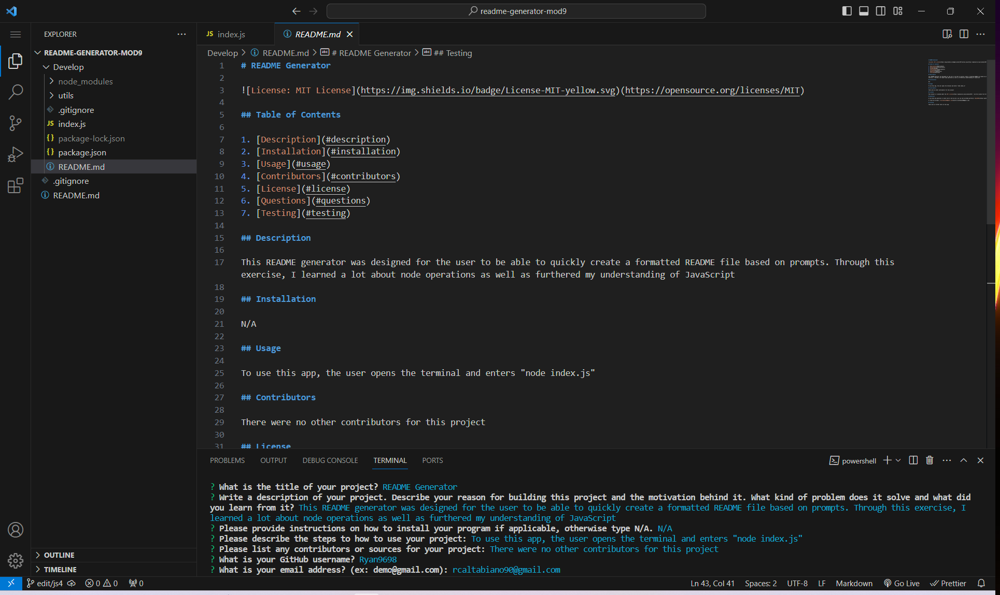

# README File Generator (Module 9 Challenge)

## Description

This app was designed to create a formatted, professional README file based on data input by the user. After activating the app,
the user is provided with a series of prompts to which the answers are used to create the body of the README file. The user is allowed
to select a license which is then rendered near the top of the file as well as a link to the license information. The user can also supply
a GitHub account and email address to contact them.

I learned a great deal from this exercise. This exercise gave me practice with learning node and different operations and it also gave me
a deeper understanding of JavaScript and how to utilize links in ways outside of a webpage.

## Installation

N/A

## Usage

To use this app, the user needs to open the Integrated Terminal in VSCode. After opening the terminal, the user accesses the app by entering 
"node index.js". The app will then give the user a series of prompts to be answered. The answers supplied will become the body of the README file.
The user then is asked to choose a license from a list which will be rendered as a badge at the top of the file. The user may also include their 
GitHub username and e-mail address which will be converted into links for quick access if someone wishes to contact them. The file is automatically
generated and formatted.

## Credits

The files necessary for this project were pulled from The Coding Bootcamp's GitHub respository.
https://github.com/coding-boot-camp/potential-enigma

## License

Please refer to the LICENSE in the repo.

## Link:

[Video of Operation](https://drive.google.com/file/d/17qm3RimCW83qZk2BovqVQFd7kbcoXyiX/view)

## Screenshot of Terminal and Generated README

